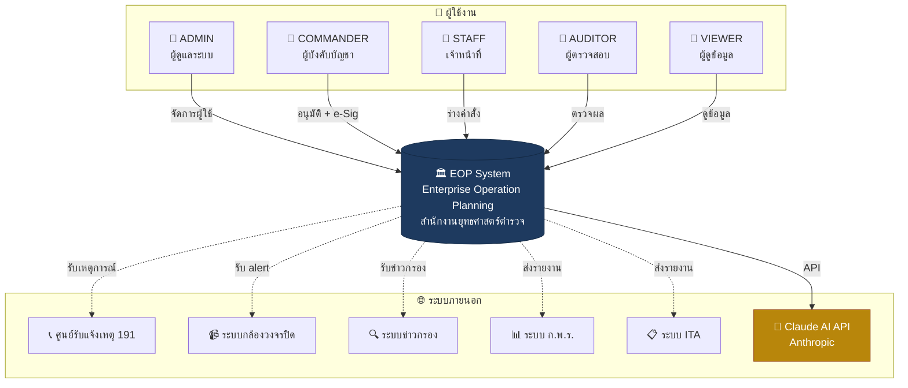
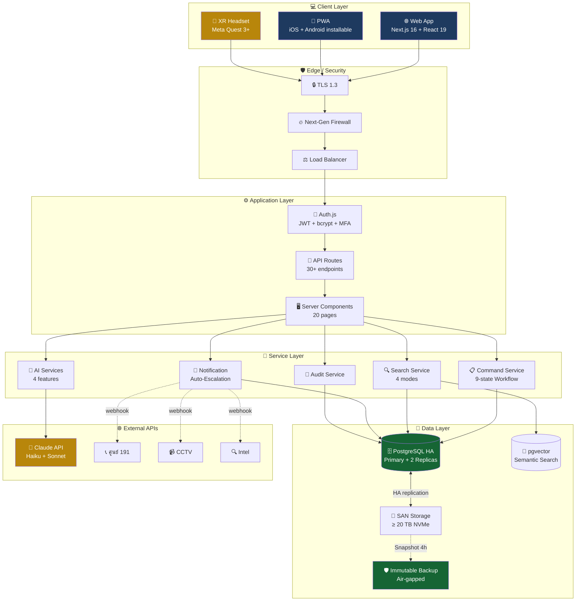
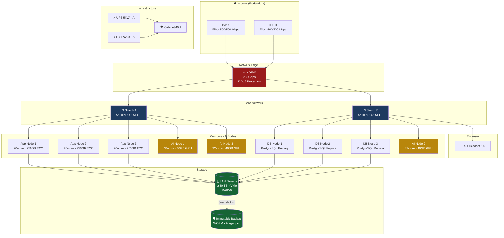
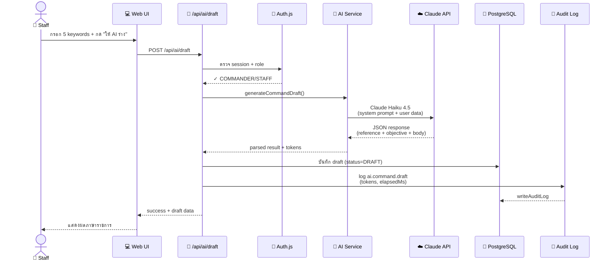
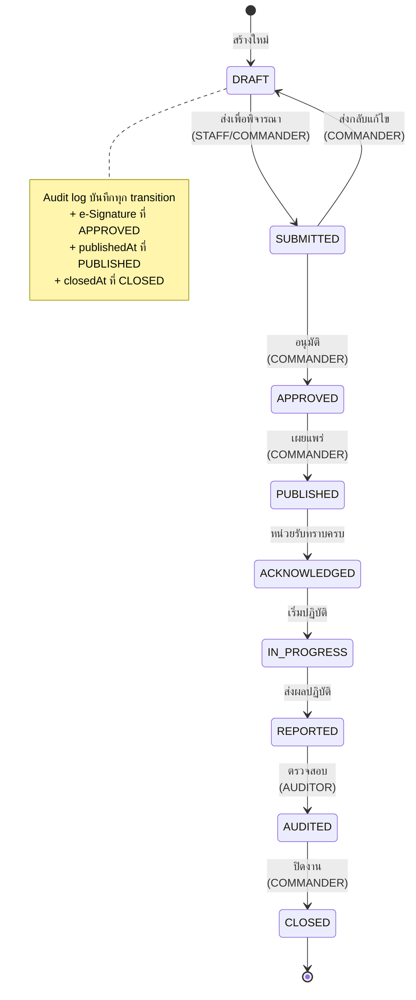
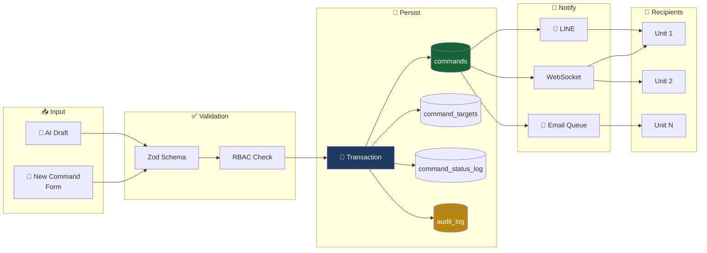
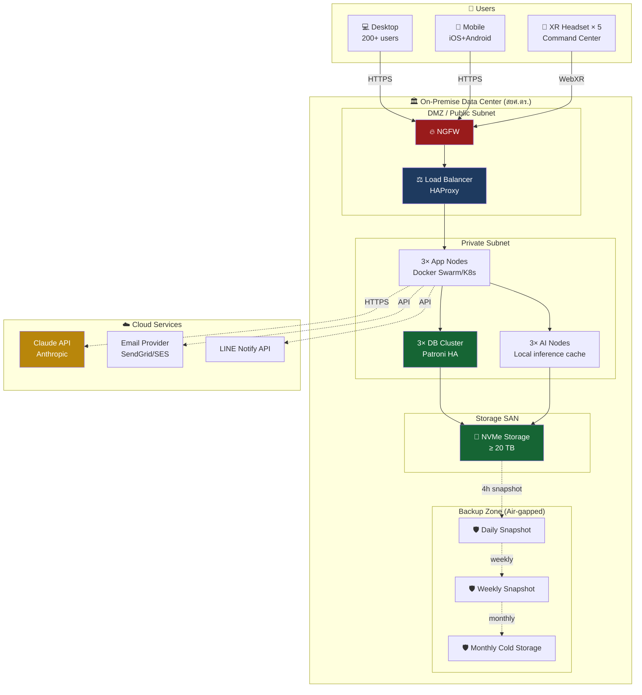
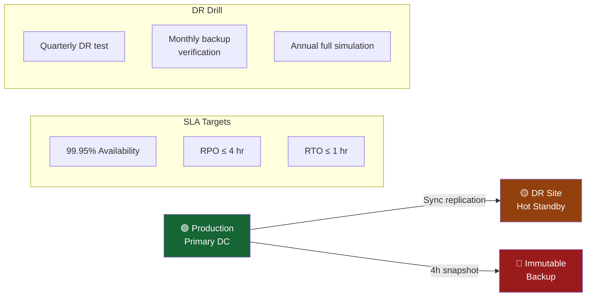
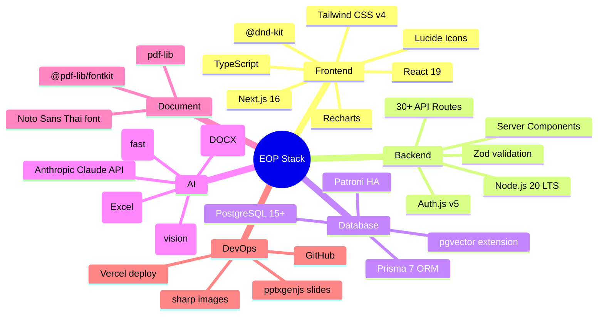

# 🏗️ EOP Architecture Diagrams

> สถาปัตยกรรมระบบ EOP — ผังภาพระดับต่างๆ
> สำหรับ pitch presentation + technical documentation

---

## 1. System Context (C4 Level 1)

ใครใช้งาน EOP และเชื่อมต่อกับอะไรบ้าง

---

## 2. High-Level Architecture (3-Tier)

---

## 3. Hardware Topology (9 Nodes + Network)

ตามภาคผนวก ข ของ TOR

---

## 4. AI Pipeline — Command Drafting (PoC 1)

---

## 5. Command Workflow — 9-State State Machine

---

## 6. Security Architecture — Defense in Depth

```mermaid
graph TB
    USER[👤 User Request] --> L1

    subgraph L1[Layer 1: Network Edge]
        FW[🔥 Firewall<br/>DDoS Protection]
        IPF[🔍 IP Filtering<br/>Whitelist + Geolocation]
    end

    L1 --> L2

    subgraph L2[Layer 2: Transport]
        TLS[🔒 TLS 1.3<br/>Perfect Forward Secrecy]
        HSTS[📋 HSTS + CSP Headers]
    end

    L2 --> L3

    subgraph L3[Layer 3: Authentication]
        MFA[🔑 MFA<br/>Authenticator App]
        JWT[🎫 JWT Session<br/>8h expiry]
        BCRYPT[🔐 bcrypt<br/>Password hash]
    end

    L3 --> L4

    subgraph L4[Layer 4: Authorization · RBAC]
        ROLE[👥 5 Roles<br/>ADMIN/COMMANDER/<br/>STAFF/AUDITOR/VIEWER]
        RLS[🔍 Row-Level Security<br/>per-unit filtering]
    end

    L4 --> L5

    subgraph L5[Layer 5: Application]
        VAL[✅ Zod Validation<br/>every API input]
        XSS[🛡️ XSS Protection<br/>React + sanitize]
        CSRF[🛡️ CSRF Tokens]
    end

    L5 --> L6

    subgraph L6[Layer 6: Data]
        AES[🔐 AES-256<br/>Encryption at rest]
        PII[🎭 PII Masking<br/>in logs]
        BACKUP[🛡️ Immutable Backup<br/>Ransomware-proof]
    end

    L6 --> L7

    subgraph L7[Layer 7: Audit · TOR 7.1.5]
        LOG[📝 Audit Log<br/>every action]
        SIEM[👁️ SIEM Ready<br/>Anomaly Detection]
        RETAIN[📅 7-year retention]
    end

    L7 --> DATA[(💾 Data Access)]

    style USER fill:#1e3a5f,color:#fff
    style DATA fill:#166534,color:#fff
    style L7 fill:#b8860b,color:#fff
```

---

## 7. Data Flow — End-to-End for Command Lifecycle

---

## 8. Deployment Topology (Production)

---

## 9. Disaster Recovery Strategy

---

## 10. Software Stack

---

## 📂 Files

| Diagram | Source | Render |
|---|---|---|
| All diagrams above | `docs/ARCHITECTURE_DIAGRAM.md` | GitHub renders Mermaid natively |
| High-fidelity SVG | `docs/architecture-overview.svg` | (Generated below) |

To view these diagrams:
- **GitHub:** Open this file on github.com — Mermaid renders automatically
- **VS Code:** Install "Markdown Preview Mermaid Support" extension
- **Online:** Copy any `mermaid` block to https://mermaid.live
- **Export:** Use `mmdc` (mermaid-cli) for PNG/SVG export

---

**Color Legend (Royal Thai Police palette):**
- 🔵 Navy `#1e3a5f` — Primary infrastructure
- 🟡 Gold `#b8860b` — AI / Highlight
- 🟢 Emerald `#166534` — Data / Storage
- 🔴 Rose `#991b1b` — Security / Firewall
